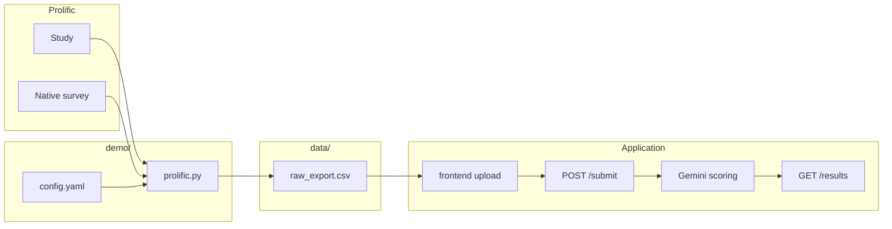

# Prolific data export — how `prolific.py` and `config.yaml` work

This document explains how the demo export script pulls data from Prolific, how
`config.yaml` maps that data into our CSV format, and how the CSV fits into the rest of the bias-audit pipeline.

---

## Where this fits in the project



1. Managers complete a **Prolific study** with a **Prolific-native survey** (or you export from an external tool manually).
2. You run `demo/prolific.py` to produce `data/raw_export.csv`.
3. You upload that CSV in the **frontend dashboard**.
4. The **backend** runs Gemini scoring and statistical analysis.

The export script produces **survey fields only** — no `trust_score` or
`criticism_score`. Those are added later by the API.

---

## Prerequisites

| Requirement | Where to get it |
|---|---|
| `PROLIFIC_API_KEY` | Prolific → Settings → API → create token. Add to project `.env`. |
| Study ID | Prolific study page URL or study list in the researcher dashboard. Passed as `--study-id`. |
| Survey ID | Prolific **native survey** ID (see below). Set in `config.yaml` or pass `--survey-id`. |
| Question IDs | UUIDs for each survey question you want to map. Set in `config.yaml` `field_mapping`. |

**Important:** This script is designed for studies that use **Prolific's built-in
survey tool**. Prolific's Submissions API returns participation metadata (who
completed, approval status) but **not** free-text answers. Answers come from the
**Surveys API**. If your study redirects participants to Qualtrics, Typeform,
Google Forms, etc., you must export from that platform instead and format the
CSV manually (see [Output CSV format](#output-csv-format)).

---

## The two Prolific APIs this script uses

Prolific separates “did this person complete the study?” from “what did they
write in the survey?”

### 1. Submissions API — participation metadata

```
GET https://api.prolific.com/api/v1/submissions/?study={study_id}&page=1&page_size=100
Authorization: Token <PROLIFIC_API_KEY>
```

**Docs:** https://docs.prolific.com/api-reference/submissions/get-submissions

**What it returns (per submission):**

| Field | Meaning |
|---|---|
| `id` | Submission ID (used to join with survey responses) |
| `participant_id` | Prolific participant identifier |
| `status` | e.g. `APPROVED`, `AWAITING REVIEW`, `REJECTED`, `RETURNED` |
| `started_at`, `completed_at` | Timestamps |
| `study_code` | Completion code entered by participant |

**What it does NOT return:** survey question text or answers.

**What the script does with it:** `fetch_approved_submission_ids()` paginates
through all pages and collects submission `id` values where `status == "APPROVED"`.
Only approved responses are exported by default (use `--include-unapproved` to
skip this filter).

### 2. Surveys API — question answers

```
GET https://api.prolific.com/api/v1/surveys/{survey_id}/responses/
Authorization: Token <PROLIFIC_API_KEY>
```

**Docs:** https://docs.prolific.com/api-reference/surveys/get-responses

**What it returns (per response):**

```json
{
  "participant_id": "5c83c95d4c266300156edc01",
  "submission_id": "63063cfc71fd74aad90886c4",
  "sections": [
    {
      "section_id": "75ac961f-d94a-4490-af8f-935ca088315f",
      "questions": [
        {
          "question_id": "3797222e-f731-4bea-838b-f668682d902d",
          "question_title": "Write a brief performance review",
          "answers": [
            { "answer_id": "...", "value": "Alex is a strong independent contributor..." }
          ]
        }
      ]
    }
  ]
}
```

**What the script does with it:** `fetch_survey_responses()` loads all results,
then for each response:

1. Checks `submission_id` is in the approved set (unless `--include-unapproved`).
2. Flattens `sections[].questions[]` into `{question_id: answer_text}`.
3. Maps those answers to export columns via `config.yaml`.
4. Drops rows with empty `raw_text`.

---

## How `config.yaml` and `prolific.py` interact

```
config.yaml                    prolific.py
───────────                    ───────────
survey_id          ──────────►  fetch_survey_responses(survey_id)
field_mapping      ──────────►  map_survey_response(...)
  manager_id                    resolve("manager_id")
  worker_type                   resolve("worker_type")
  text_type                     resolve("text_type")
  raw_text                      resolve("raw_text")

CLI --study-id     ──────────►  fetch_approved_submission_ids(study_id)
CLI --survey-id    ──────────►  overrides config survey_id
CLI --output       ──────────►  write_csv path (default: data/raw_export.csv)
CLI --config       ──────────►  path to this YAML file
```

### `survey_id`

The ID of your **Prolific-native survey** (not the study ID). Required.

How to find it:

- Survey builder URL in the Prolific dashboard often contains the survey ID.
- Or call the Surveys API and list your surveys.
- Or inspect any `GET .../surveys/{survey_id}/responses/` response after a test
  completion.

You can set it in `config.yaml` or pass `--survey-id` on the command line (CLI
wins).

### `field_mapping`

Maps **export column names** (left) to **Prolific sources** (right).

| Export column | Typical `field_mapping` value | Source in Prolific |
|---|---|---|
| `manager_id` | `participant_id` | Top-level field on survey response (not a question) |
| `worker_type` | `<question_id UUID>` | Answer to “Was the employee remote or in-person?” |
| `text_type` | `<question_id UUID>` | Answer to “What type of text is this?” (optional) |
| `raw_text` | `<question_id UUID>` | Answer to “Write a performance review” (required) |

**Left side (keys)** — fixed. Must match `REQUIRED_OUTPUT_COLUMNS` in
`prolific.py`: `manager_id`, `worker_type`, `text_type`, `raw_text`.

**Right side (values)** — either:

- `participant_id` or `submission_id` — read from the survey response object.
- A **question_id UUID** — read from that question’s `answers[].value` in the
  survey response.

If a question allows multiple selections, values are joined with `"; "`.

### Defaults applied by the script

| Column | Default if missing |
|---|---|
| `manager_id` | Falls back to `participant_id` from the survey response |
| `text_type` | `"performance_review"` |
| `worker_type` | No default — row may be invalid for analysis if empty |
| `raw_text` | Row is **dropped** if empty |

### Example `config.yaml` (filled in)

```yaml
survey_id: "60aca280709ee40ec37d4885"

field_mapping:
  manager_id: participant_id
  worker_type: "a1b2c3d4-e5f6-7890-abcd-ef1234567890"
  text_type: "b2c3d4e5-f6a7-8901-bcde-f12345678901"
  raw_text: "c3d4e5f6-a7b8-9012-cdef-123456789012"
```

Ensure your survey question for `worker_type` uses answer values exactly
`remote` or `in_person` — the frontend and backend validate those literals.

---

## Running the script

From the project root, with `.venv` activated and `PROLIFIC_API_KEY` in `.env`:

```bash
python demo/prolific.py --study-id YOUR_STUDY_ID
```

With explicit survey ID and custom output path:

```bash
python demo/prolific.py \
  --study-id YOUR_STUDY_ID \
  --survey-id YOUR_SURVEY_ID \
  --output data/raw_export.csv
```

Useful flags:

| Flag | Purpose |
|---|---|
| `--study-id` | **Required.** Prolific study to filter approved submissions. |
| `--survey-id` | Override `survey_id` in config.yaml. |
| `--config` | Path to YAML mapping file (default: `demo/config.yaml`). |
| `--output` | Output CSV path (default: `data/raw_export.csv`). |
| `--include-unapproved` | Export all survey responses, not only `APPROVED` submissions. |

Example output:

```
Wrote 12 row(s) to data/raw_export.csv (approved submissions in study: 14)
```

If `Wrote 0 row(s)`:

- Study may have no `APPROVED` submissions yet — approve in Prolific or use
  `--include-unapproved` while testing.
- `survey_id` may be wrong.
- `field_mapping` question IDs may not match your survey.
- `raw_text` question may be empty for all participants.

---

## Output CSV format

Written to `data/raw_export.csv` by default:

```csv
manager_id,worker_type,text_type,raw_text
60bf9310e8dec401be6e9615,remote,performance_review,"Needs frequent check-ins..."
60bf9311e8dec401be6e9616,in_person,performance_review,"Excellent teammate..."
```

| Column | Type | Notes |
|---|---|---|
| `manager_id` | string | Usually Prolific `participant_id` |
| `worker_type` | `remote` \| `in_person` | Experimental condition |
| `text_type` | string | e.g. `performance_review`, `email` |
| `raw_text` | string | Manager-written evaluation (quoted if needed) |

No score columns — upload this file in the frontend; `POST /submit` adds
`trust_score` and `criticism_score` via Gemini and appends to
`data/submissions.csv`.

A reference file with the same shape lives at
`data/sample_raw_export.csv`.

---

## `prolific.py` function reference

| Function | Role |
|---|---|
| `load_config()` | Reads `config.yaml`; supplies defaults if file missing. |
| `prolific_headers()` | Builds `Authorization: Token ...` header for Prolific. |
| `fetch_approved_submission_ids()` | **Submissions API** — approved submission IDs for a study. |
| `fetch_survey_responses()` | **Surveys API** — all responses with question answers. |
| `extract_question_answers()` | Flattens nested sections/questions to `{question_id: text}`. |
| `map_survey_response()` | Applies `field_mapping` to produce one export row. |
| `write_csv()` | Writes rows to disk with standard column order. |
| `main()` | CLI entrypoint; orchestrates fetch → filter → map → write. |

---

## External survey platforms (Qualtrics, Typeform, etc.)

If your Prolific study uses an **external** survey URL, this script cannot
fetch answers — Prolific only stores completion metadata for those studies.

**Workaround:**

1. Export responses from your survey platform as CSV.
2. Rename/reorder columns to match the [output format](#output-csv-format).
3. Upload directly in the frontend (skip `prolific.py`).

You can still use the Submissions API manually to get `participant_id` lists if
you need to filter external exports to approved participants only.

---

## Troubleshooting

| Symptom | Likely cause | Fix |
|---|---|---|
| `PROLIFIC_API_KEY is not set` | Missing `.env` | Add `PROLIFIC_API_KEY=...` to `.env` |
| `survey_id is required` | Not in config or CLI | Set `survey_id` in `config.yaml` or pass `--survey-id` |
| HTTP 401 | Invalid or revoked token | Regenerate token in Prolific settings |
| HTTP 404 on surveys endpoint | Wrong `survey_id` | Confirm ID is for a Prolific-native survey |
| 0 rows written | No approved subs or bad mapping | Approve submissions; verify question IDs in config |
| Empty `worker_type` in CSV | Wrong question_id in mapping | Copy UUID from survey builder / API response |
| Rows missing vs. completions | Filtered to APPROVED only | Approve pending submissions or use `--include-unapproved` |

---

## Security notes

- `PROLIFIC_API_KEY` has full account access. Keep it in `.env` (gitignored).
- Do not commit `data/raw_export.csv` if it contains identifiable participant
  text; it is gitignored alongside `data/submissions.csv`.
- Rotate the token in Prolific immediately if it is exposed.

---

## Related files

| File | Purpose |
|---|---|
| [`demo/prolific.py`](prolific.py) | Export script |
| [`demo/config.yaml`](config.yaml) | Survey ID and question mapping |
| [`data/raw_export.csv`](../data/raw_export.csv) | Default export output (created at runtime) |
| [`data/sample_raw_export.csv`](../data/sample_raw_export.csv) | Example CSV for frontend testing |
| [`frontend/`](../frontend/) | Upload UI for CSV → API |
| [`api/main.py`](../api/main.py) | `POST /submit`, `GET /results` |
